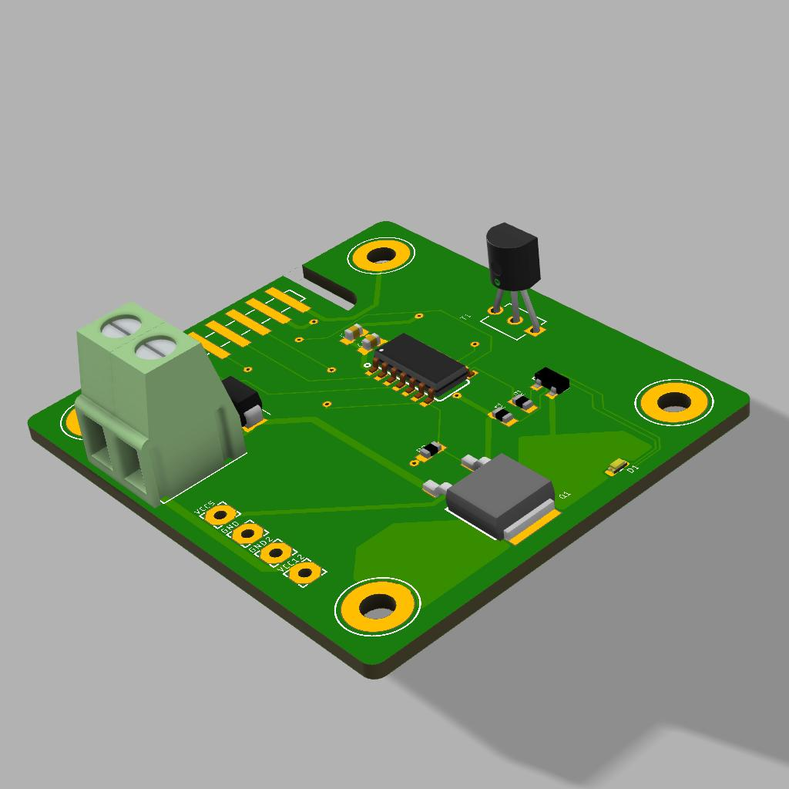

Temperature control for rack
============================

Read temperature and set the FAN accordly
-----------------------------------------
Read temperature via DS18B20  
Set the speed of the Fan accordly.  
Up to 16W / 12v  

### Attiny84  
SPI Through BusPirate 
arduino framework  

Warning: Flash on Board  
Buspirate set on 5v  
Additionnal power to 5v  
fuse flashed before mounting  

Tips
----
`./serial` launch serial console through buspirate  
`pio run -t fuses` set the fuses  
`pio run` process/build project from the current directory  
`pio run -t upload` - upload firmware to a target  
`pio run -t clean` - clean project (remove compiled files)  
`pio run -t upload -e release` upload release version without serial debug  
`pio platform update --dry-run` check for updates  

